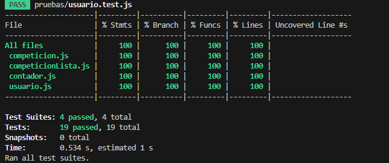

# Informe académico (entrega segunda instancia)

## Cambios realizados:

Para esta entrega se añadieron en el proyecto los requerimientos funcionales que no estuvieron en la segunda entrega. Se puede modificar un resultado previamente ingresado con una mejor interfaz de usuario en el apartado de pronostico de los partidos, se cambiaron aspectos visuales y de logica para lograr esto, tambien se agrego la fecha de los partidos que era algo que faltaba en el RF3. Se agrego la funcionalidad de abandonar una competicion de forma sencilla, simplemente colocando un boton con el texto "abandonar" al crear o unirse a una competicion.

## Requerimientos añadidos 
- RF8: Permitir a los jugadores modificar un resultado previamente ingresado.
- RF9: Los jugadores pueden abandonar las competiciones en el momento que quieran de forma sencilla.

## Alcance requerido
RF1: Permitir a los jugadores unirse a competiciones o crear competiciones de penca, estableciendo reglas personalizadas como la selección de partidos, la duración de la competición y las apuestas mínimas.
RF3: Mostrar una lista de partidos disponibles para pronosticar, incluyendo información como equipos participantes, fecha, hora y competición.
RF4: Permitir a los jugadores realizar pronósticos sobre los resultados de los partidos, seleccionando el ganador o el resultado exacto.
RF5: Mostrar una tabla de clasificación que refleje la posición de cada usuario en la competición en función de su puntuación acumulada.
RF8: Permitir a los jugadores modificar un resultado previamente ingresado.
RF9: Los jugadores pueden abandonar las competiciones en el momento que quieran de forma sencilla.

Ahora se ven reflejados en el proyecto todo los requerimientos solicitados al haber agregado los RF8 y RF9.

Respecto a la cobertura en los test unitarios esta es del 100% y se añadieron test para la clase contador que fue la unica clase no testeada en la segunda parte del proyecto, se puede apreciar en la siguiente imagen que cumple el 100% de cobertura:

 